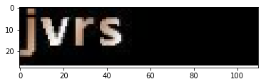
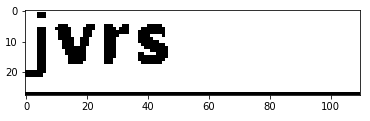
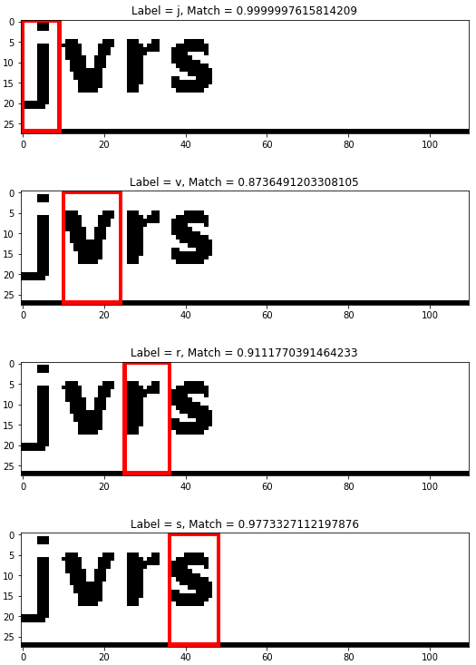

# Decode simple captcha using Template Matching
## Process
```text
+-------+    +--------------+    +----------+    +--------+    +--------+
| input +--->| thresholding +--->| template +--->| select +--->| output |
+-------+    +--------------+    | matching |    +--------+    +--------+
                                 +----------+
                                      ^  
                                      |
                                 +----------+
                                 | table of |
                                 | symbols  |
                                 +----------+
``` 

## Example

### Input


### Thresholding


### Matches


## Library Usage
```python
import senescyt as se

path = './img/captcha_1.png'
# Read Symbols
st = symbols('./symbols_4')
# Read Image
img = cv2.imread(path)
img_bw = img2bw(img)
# Detections
detections = decode(img_bw, st)
st_decoded = get_string(detections)
print(st_decoded)

```